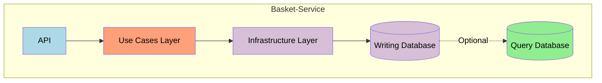
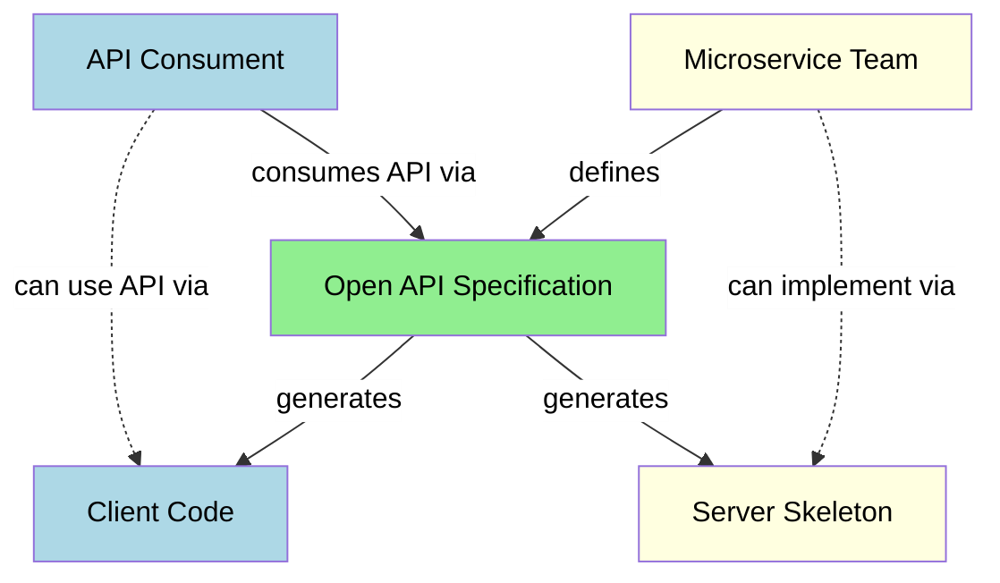
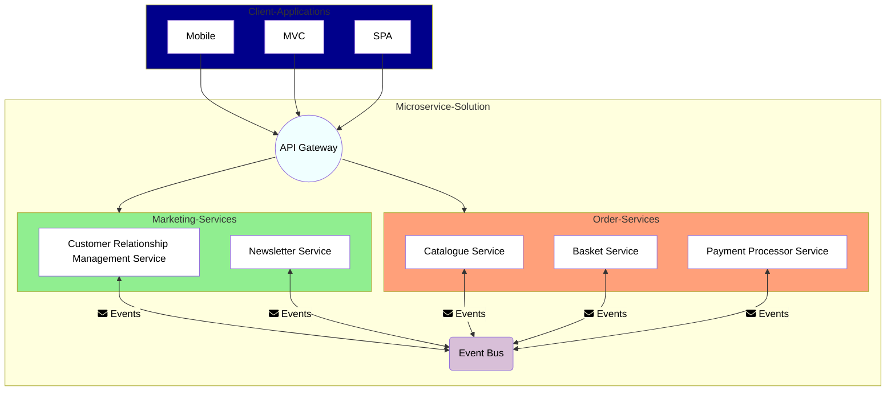
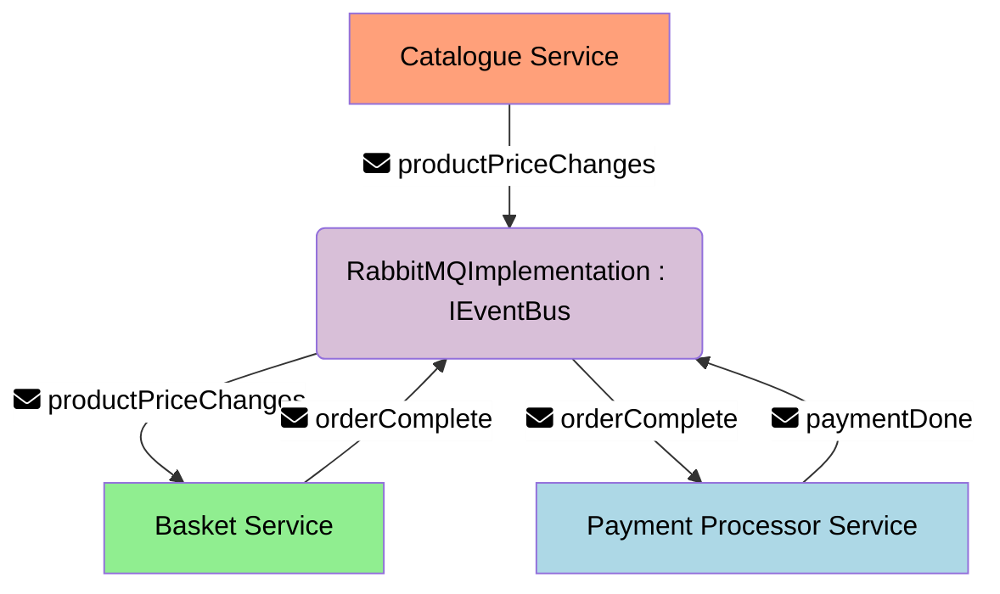
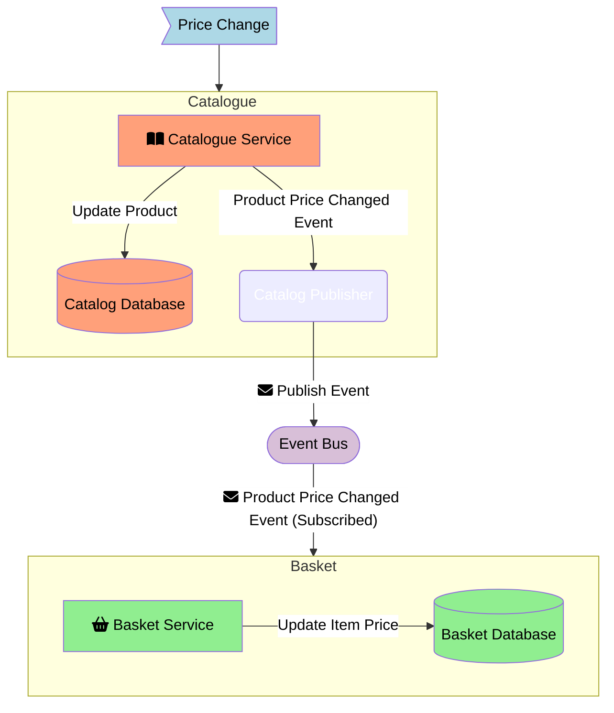

import Image from 'next/image'

<Image
  src="/images/coding.jpg"
  alt="Computer to code"
  width={1280}
  height={853}
  className="next-image"
/>

With the rise of platforms for infrastructure like Azure, Google Cloud Computing and AWS but also Kubernetes as the OS of the cloud, it is getting easier to change said platforms but also orcestrate a large amount of containers. This leads to Microservices getting more and more useable although having quite some challenges to tackle.

## Why Microservices?

Compared to monolithic applications microservices are not only logically but also physically bound within a domain. While it's also possible to cut contexts and set up boundaries between different domains within a monolith, it is also easier to bypass them. 

Microservices built upon the idea of bounded contexts of [Domain-Driven-Design (DDD)](https://martinfowler.com/bliki/DomainDrivenDesign.html). They should be handling a single bounded context, which allows to split teams into those domains. As said in [Team Topologies](https://teamtopologies.com/), we can organize our team around such domain boundaries into value-stream, complex-subsystem, platform or enabling teams. The product to develop is within the overall business domain, complete and sized down to its core, reducing the cognitive load of the team that works on the service. To establish a working relationship between services and their teams, *contracts* about the API needs to be agreed upon to ensure provision and consumption of functionality and data is a given.

Compared to a monolithic approach, services can be scaled out. This means that high usage parts of the solution can be scaled to fit the need. In a monolith the whole application needs to be duplicated everytime to achieve that. Furthermore, it is possible to work on single services and release new versions without the need to involve others, if the established contract between services is still satisfied. We can achieve better resource management, high availability and performance with microservices due to scaling out certain services.

On the other hand, we are building a highly distributed system that comes with the complexity and issues of distributed systems. Transactions may span multiple services, the data across services isn't consistent all the time and we need to communicate a lot more via network.

### Pros

* Need to set up boundaries within our problem space and define subdomains to handle
* Works great with DDD on a macro level as both have the need to think about the domain as a whole and split it apart into smaller spaces
    * within a microservice DDD might be applicable but simple CRUD services might also be ok, depending on the service
* Allows to organize teams according to [Team Topologies](https://teamtopologies.com/) as boundaries are set up and teams can be defined and assigned to them
* Possibility to scale out single services that are used more often
* Teams can work autonomously and release new versions without involving others, if the contract is still satsified

### Cons

* Higher complexity
* Data consistency needs to be handled differently
* Traceability and Logging needs to be aggregated to get the whole picture
* Many more reasons and places for failures
* Communication must be carefully designed to due network latencies

## Service Boundaries

To determine the boundaries of a microservice the techniques for identifying [bounded contexts](https://martinfowler.com/bliki/BoundedContext.html) in DDD can be used. So with that in place, we got our contexts, know the borders of microservices and where they need to work together. But what does this mean for the inner workings of our microservice?

First, we need to establish some ground rules so that teams can work with as less hindrances as possible. Each microservice team should be responsible for their service and also able to autonomously work on it. This enables them to be agile about it and align to activities that add value to their product. If they are as much decoupled as possible, they aren't depending on others and with clear interfaces in place are allowed to adjust their service continously and more flexible. 

This also means that they are covering the whole stack besides frontend for their service, making the database part of their subdomain solution. Without a central database, we lose consistency because we don't persist everything in one swing. This does not have to be as much of a problem. Most businesses, if known to them, work well with *eventual consistency*, meaning that we trigger events that inform other services about changed data and necessary integrations of updated data in their databases. In the long run, with services owning their own databases, this opens up the possibility to separate reading and writing databases from each other in case there is need for faster query databases or decoupling with the [CQRS](https://learn.microsoft.com/en-us/azure/architecture/patterns/cqrs) pattern.

## Contract-Driven-Development

With the boundaries in place, we need to make sure that everything stays as described. [OpenAPI](https://www.openapis.org/what-is-openapi) as an example for API specifications comes in handy. OpenAPI and its tools allow to write specifications of APIs. Those specifications can not only be deployed as documentation that allows to be run as demos or even tests against the implemented API, but also can generate skeletons and stubs for the server and client side. Much as a Interface Description Language (IDL) changes to those specifications mean changes in our contract between services. In such cases the other services teams need to be involved as they might not be able to consume an API the same way as before.

## Patterns

Some patterns are used more frequently in context of microservices. The following sections will focus on patterns regarding the challenges of microservices and not the inner workings of a service.

### API Gateway Pattern

To establish communication with client applications like mobile apps, web apps (MVC) or Single Page Applications (SPAs), it's necessary to have some kind of way. There is always the possibility to directly request something from a service, but it's discouraged as the composition of microservices is supposed to be transparent. To prevent direct communication the usage of an API Gateway is common. This provides APIs to the outside and in consequence the clients. It is able to call the microservices as necessary. Because the API gateway provides the interface for the client applications, it provides the contract for those applications. On the other hand, it relies on the contracts that the microservice need to fulfill.

Having multiple API gateways allows to separate feature sets and/or types of client applications ([Backend for Frontend](https://medium.com/mobilepeople/backend-for-frontend-pattern-why-you-need-to-know-it-46f94ce420b0)) and let those microservices develop independently from other services. Moreover by mocking the gateway tests can be written by the client applications or microservices to ensure that the contracts are still satisfied.

### Publish-Subscribe Pattern and Event Bus

Microservices aren't tightly coupled but use asynchronous and indirect communication between each other. They don't know about each other mostly and use a broker to communicate. This can be done via an event bus that speaks some kind of lightweight protocol. The [publish-subscribe pattern](https://en.wikipedia.org/wiki/Publish%E2%80%93subscribe_pattern) allows microservices to subscribe to a topic or channel and publishers write to such topics/channels, informing every service that is subscribed to it. This way publisher-services don't know about dependent services while subscribing services receive just the events they are relying on.

Because the event bus is a seperate container it must be ensured that messages aren't lost and retries are happening, if necessary. [RabbitMQ](https://www.rabbitmq.com/) as a low-level broker is at least able to tell that messages are redelivered in case they were sent once already. Other event buses might be more sophisticated. It is recommended to abstract the implementation for the event bus for each microservice and use the abstraction internally in case the event bus will be changed in the future.

### Saga Pattern

As explained for eventual consistency, every microservice holds their own data. Without a central database transactions have to be done in a distributed system and via distributed transactions. The [saga interaction pattern](https://microservices.io/patterns/data/saga.html) establishes said saga across multiple services to tell a story about what is happening. After each transaction in a microservice the saga will either continue until it is completed or return with a failure leading to reverting the operations that happened. 

One way to make this happen is to define the commit events (start and end of each operation) and compensating events (in case a failure happened) to rollback changes made. This means we need workflows for a happy saga or failure saga to know which actions will follow. An orchestrator can coordinate the saga based on its current state and the mapped commands that define the correlating workflows. An example implementation can be found in the [serverless saga orchestration](https://github.com/Azure-Samples/saga-orchestration-serverless/blob/main/docs/saga-orchestrator.md) for Azure and its [orchestrator implementation](https://github.com/Azure-Samples/saga-orchestration-serverless/blob/main/docs/saga-orchestrator.md).

## Eventual Consistency

Each microservices takes care of their data and has in consequence data sovereignty. But changes to the price of a product should still be applied not only to the catalogue service that holds information about products, but the shopping basket that might currently contain that item. Such information need to be propagated so that dependend services can update their internal data if necessary. The already described event bus allows to subscribe to such events and handle them inside those microservices that need to consume them for any reason. This communication also means that not every service of our solution has always the latest data, but will be updated asynchronously. Whether or not this behaviour is alright with business or what constraints have to be satisfied, is to be discussed. To achieve this eventual consistency integration events can be used.

According to the CAP theorem we can't have Consistency, Availability and Partition Tolerance. As microservice solutions strive for high availability and partitioning we need to neglect consistency. This is why we need to embrace eventual consistency on an overall level when using microservices.

### Integration Events

Integration events are used to inform other services about data changes and their need to integrate those changes into their database. Looking at Amazon we can store items in our basket. If at some point later but before ordering the price of a product changes, the basket service needs to be informed about the price change. This is when the user is shown a little text in the basket that the price changed since putting the item in the basket.

What might happen is

Important to notice is that as we are using network communications there might be failure in deliveries. Retry logics should be in place to prevent loss of messages but what happens when messages are incoming more than once? Integration events should be idempotent so that changes don't lead to race conditions or wrong updates. This could mean that the service knows when a duplicate message arrives that is already handled or that simply applying the message multiple times does no harm. Moreover we might want to make sure that we don't apply old updates after newer ones. "Setting the price to 25$" is better than "Raising the price by 5$" but when there are two events for setting the price to 25$ and then 30$ and updates happen in the reverse order it's still wrong. 

One could think about using a shared integration event library to define those events once only. But beaware as this leads to dependencies that may not be wanted. Services are tightly coupled to this library in such cases and might not be able to be developed more independently.

## What's left unsaid

* Orchestrators: Often [Kubernetes](https://kubernetes.io/) is used to tackle this challenge and will handle setting up new instances of services in case some failed, handling service discovery. Others could be used and the simplest way to get some services up and running is using [docker-compose](https://docs.docker.com/compose/). Yet missing in this article.
* Patterns
    * [Event-Sourcing](https://microservices.io/patterns/data/event-sourcing.html)
    * [Transactional Outbox Pattern](https://microservices.io/patterns/data/transactional-outbox.html)
    * [Request Aggregation Pattern](https://learn.microsoft.com/en-us/azure/architecture/patterns/gateway-aggregation)
    * [Backend for Frontend](https://medium.com/mobilepeople/backend-for-frontend-pattern-why-you-need-to-know-it-46f94ce420b0)
* [Distributed Tracing](https://microservices.io/patterns/observability/distributed-tracing.html)
* [Health Check API](https://microservices.io/patterns/observability/health-check-api.html)
* [Log Aggregation](https://microservices.io/patterns/observability/application-logging.html)

## Useful Tools

* [Swagger](https://swagger.io/): Allows to specificy OpenAPIs and generate code for those specifications
* Message Broker for the Event Bus: [RabbitMQ](https://www.rabbitmq.com/), [Azure Service Bus](https://azure.microsoft.com/en-us/products/service-bus), [NServiceBus](https://particular.net/nservicebus), [MassTransit](https://masstransit.io/)
* API Gateways: [Ocelot](https://github.com/ThreeMammals/Ocelot)